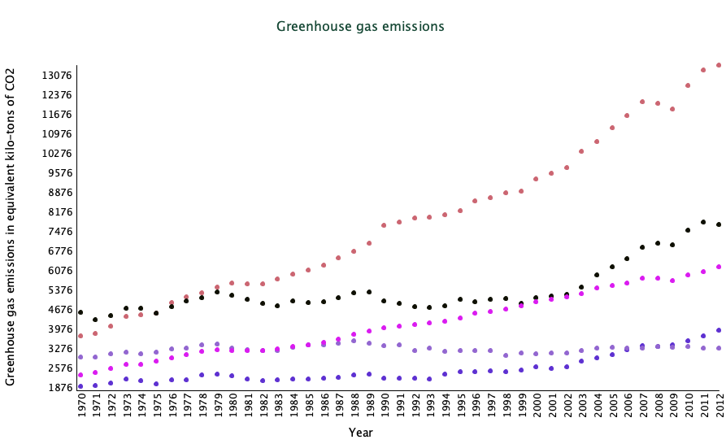
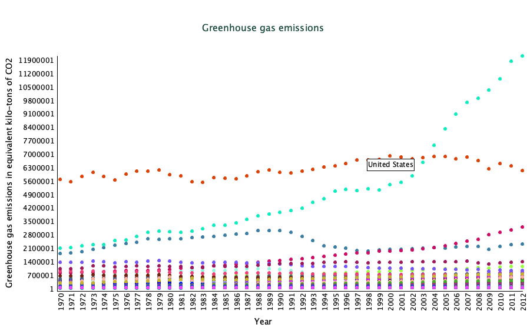

# Lab 3, CSC/CPE 203 &mdash; Interfaces

Remember the greenhouse gas emissions data we played with in Lab 2? In this lab, we will create some simple but powerful visualisations of the data to help us understand it a bit better.

## Objectives

* To develop and demonstrate basic object-oriented development skills. Much of the structure of the solution is given&mdash;use good judgement when "filling in the blanks".
* To become familiar with Java interfaces and the concept of polymorphism.
* To practice using the `instanceof` operator.
* More practice using existing classes and interfaces from the Java standard library, such as: `List`, `ArrayList` and `LinkedList`.

## Given files

Obtain the starter code for this lab at the provided GitHub link: **TODO**

A number of files are provided to you to begin with. Take a moment to peruse these files:

* `Main.java`: The entry point for this program. This class simply creates a `Plotter` (see next). No modifications are needed to this file.
* `Plotter.java`: Plots greenhouse gas emissions data. Some modifications will be made to this file.
* `EmissionsDatabase.java`: Loads emissions data from provided data files and makes it available for analysis. Small change will be needed to this file. Take some time to read through the methods (or method comments) in this file to understand the functionality it provides.

**If you have any questions about these files, don't hesitate to ask the instructor or your neighbour.**

## Setup 

Run the program from the `main` method. You should see figure like the following (point colours may be different):



The figure displays global emissions data for different industry sectors from 1970 to 2012. We can immediately notice some trends from the data. For example, the Power industry's greenhouse gas emissions have risen quite dramatically over the last two decades.

## Tasks

Take a look at `Plotter.java`. This file makes use of a library called _[processing](https://processing.org)_ to help create the graph. Take some time to read the method comments in this file, then focus your attention on the `plotSectorData` method.

Note the following:

* The method takes in a `List<Sector>`. This list can be obtained from the `EmissionsDatabase`.
* The graph plotting code makes use of the minimum and maximum Sector emissions, also obtained from the `EmissionsDatabase`.
* _Importantly, the method only lets us plot Sector data._

Our task in this lab is to modify this method to allow it to work with both `Sector` data and `Country` data. We will accomplish this using the Object-oriented construct of an _interface_.

> Below, items marked with **_TODO_** are tasks that you must complete.

### Part 0

First, let us consider how we would incorporate `Country` objects into this existing code.
We'll take the simplest possible route, and simply write another plotting method that works with `Country` data.

**_TODO_** In `Plotter.java`, make a copy of the `plotSectorData` method, and rename it to `plotCountryData`.

**_TODO_** Read through the code in the method and replace references to _sectors_ with references to _countries_. For example:

* The method takes in a `List<Sector>` as its parameter. **Change this to a `List<Country>`**
* The for-each loop is looping through a list of `Sectors`. **Change this to loop through the `List<Country>` that is the new method parameter.**
* The third line of the method&mdash;the one that calls `writeEmissionsAxis`&mdash;draws the y-axis for the graph. To do this, it referse to the minimum and maximum `Sector` emissions from the `EmissionsDatabase` methods `getSectorMinEmissions` and `getSectorMaxEmissions`, respectively. **Change this to refer to the min and max _`Country`_ emissions.**
* Finally, look for the line that calls `mapEmissions`&mdash;this line figures out where each data point will be drawn. It also refers to the `Sector`-specific min and max values. **Change this to instead refer to the `Country` min and max values.**

**_TODO_** In the `draw` method, call your new `plotCountryData` method, making sure to give it a list of countries. That is, change

`this.plotSectorData(this.db.getSectors());`

to

`this.plotCountryData(this.db.getCountries());`

> <span style='color: darkorange;'>**Run the program.**</span> You should now see a plot of greenhouse gas emissions by Country, similar to the one below (colours may vary). _Only move on if you see this plot._



---

Do you see a problem with what we've done? We've deviated from an important principle in software development&mdash;the DRY principle. It stands for _don't repeat yourself_. We are currently repeating ourselves a whole lot by having two nearly identical methods, one for plotting Sector data and one for plotting Country data.

> <span style='color: darkorange'>**Why is this a problem?**</span> Suppose we wanted to change the plot so that it displayed squares instead of circles. Or suppose we wanted to do something more complex like display the exact emission amount when we hover over a given data point. We would need to implement each piece of functionality twice&mdash;once for Sectors and once for Countries. And if we wanted to support other kinds of Greenhouse Gas emitters, like US states or individual companies? That's THREE times we need to make all future changes. The probability of introducing bugs _skyrockets_ under these conditions. 

We can avoid this by making use of Object-oriented design principles. Specifically, we will use an _interface_.

### Part 1

**_TODO_** Create a new interface called `GreenhouseGasEmitter`.

The interface should have the following abstract methods:

* `String getName()`
* `double getTotalEmissionsInYear(int year)`

**_TODO_** Make `Country.java` and `Sector.java` `implement` the interface you just created.

This means that `Country.java` and `Sector.java` ought to have the following methods:

* `public String getName()`: Return the name of the `Country` or `Sector` 
* `public double getTotalEmissionsInYear(int year)`: For the `Sector`, simply return the value in its map of emissions corresponding to the given year. For the `Country`, recall that the emissions are stored as `Emission` objects, keeping track of CO2, CH4 and N20 emissions. Return the _total_ emissions for the given year, i.e., CO2 + CH4 + N20.

> <span style="color: darkorange;">**Important**:</span> Make sure the code is still working correctly by plotting both Sector and Country data. That is, make the `draw` method call `plotCountryData` once, and make it call `plotSectorData` once. Only move on once you have confirmed that you can see both plots.

### Part 2

We now have the `GreenhouseGasEmitter` interface. Let's update our `plotSectorData` method to use it.

This part is a bit more work than the rest. But we'll approach it step-by-step! In high-level terms, we want to _refactor_ the method so that it is not working specifically on `Sectors`, but rather can work on any `GreenhouseGasEmitters`. Read the code in the method and see if you can identify spots where we need to become a bit more general and less "sector-y".

I see the following:

* The method name, `plotSectorData` definitely needs to change.
* The method takes in a `List<Sector>` as its parameter.
* The for-each loop is looping through this list of `Sectors`.
* The line that calls `writeEmissionsAxis`. To do this, it refers to minimum and maximum `Sector` emissions obtained from the `EmissionsDatabase` methods `getSectorMinEmissions` and `getSectorMaxEmissions`, respectively.
* The line that calls `mapEmissions` figures out the y-coordinate where each data point will be drawn&mdash;this line also refers to `Sector`-specific min and max values.

Notice that this list of required changes looks a lot like the list of items we updated in `plotCountryData`. Where previously we were changing from Sector to Country, we are now changing from Sector to any GreenhouseGasEmitter.

Below, we will understand and tackle these changes one-by-one. _Read the following carefully._

**_TODO_** The first step is to rename the method. Let's call it `plotEmissionsData`. Call this method in the `draw` method. Run the program to see that the Sector plot still appears.

We could change the `List<Sector>` to work with `GreenhouseGasEmitter` right now, but the other changes are more local to `Plotter.java`. We can make our lives easier by tackling them first.

So we move on to the line with that calls `writeEmissionsAxis`. Currently, the line reads:

```java
writeEmissionsAxis(this.db.getSectorMinEmission(), this.db.getSectorMaxEmission());
```

The method `writeEmissionsAxis` needs the min and max value for the y-axis, and we are currently passing it the min and max values for `Sectors` specifically. But we want the `plotEmissionsData` method to work with any `GreenhouseGasEmitters`, and that means not "hard-coding" `Country` or `Sector`-specific data. Let's "lift" this min/max business up.

We'll give the `draw` method control over this, since that is where the decision to plot Sectors or Countries is actually being made.

**_TODO_** Modify the `plotEmissionsData` method signature so that it takes two additional parameters, like so:

```java
plotEmissionsData(List<Sector> sectors, double min, double max)
```

**_TODO_** Change the call to `writeEmissionsAxis` to use these provided `min` and `max` values. 

**_TODO_** Do the same for the call to `mapEmissions`.

**_TODO_** Finally, since you have changed the `plotEmissionsData` method definition, you also need to change its usage. So in the `draw` method, where `plotEmissionsData` is called without specific min and max values, change it to use the Sector min and max values:

```java
this.plotEmissionsData(this.db.getSectors(), this.db.getSectorMinEmissions(), this.db.getSectorMaxEmissions())
```

> <span style='color: darkorange;'>**Think:**</span> Why is it okay to be "sector-specific" here? Because here, we are a _consumer_ of the `plotEmissionsData` method&mdash;we are making the decision to plot sector data, but we are not _forced_ to do so. Well, we are, but we'll soon change that!

Run the program and confirm that you're still seeing the sector data graph.

Our goal now is to complete this change to be able to plot `Country` data if we so choose.

Remember the `GreenhouseGasEmitter` interface? Let's use it.

**_TODO_** Change the `plotEmissionsData` method signature to accept a `List<GreenhouseGasEmitter>` instead of a `List<Sector>`. For the sake of consistency, also rename the parameter variable from `sectors` to `emitters`.

Uh-oh, we now have syntax errors!

**_TODO_** Remember the for-each loop? Modify it to work on the `emitters` object.

```java
for (GreenhouseGasEmitter emitter : emitters) // for each GreenhouseGasEmitter in emitters...
```

Notice that there is now a syntax error in the `draw` method where you call `plotEmissionsData`. If you hover your mouse over it, it will tell you that the `plotEmissionsData` method expects `List<GreenhouseGasEmitter>`, but you are giving it a `List<Sector>`.

Therefore, we will change the program so that when we call `plotEmissionsData` we give it an object of type `List<GreenhouseGasEmitter>`. To make this change, we will venture into `EmissionsDatabase.java`, which is where the `List<Sector>` comes from. Open that file.

Note that the instance variable `sectors` in this class is of type `List<Sector>`. Related to this, the getter method `getSectors` returns a `List<Sector>`.

**_TODO_** Change both the variable type and the getter method's return type to `List<GreenhouseGasEmitter>`.

**_TODO_** Since the goal is to easily plot `Sector` or `Country` data, do the same for the `countries` instance variable and `getCountries` getter method. (After all, `Country implements GreenhouseGasEmitter` as well.)

Upon returning to `Plotter.java`, see that the syntax errors have disappeared. Run the program again, ensuring that the graph showing Sector data appears.

> **So what have we achieved?** We have now made many changes to our program, but it is functionally identical to what we had before. However, we've improved the quality of our code&mdash;it is now easier to modify to accommodate changing requirements. This is a core tenet of _agile software development_. In this case, the changed requirement is that we should be able to plot either `Sector` data or `Country` data, as we choose.

**_TODO_** Modify the arguments passed to `plotEmissionsData` so that it plots `Country` data instead of `Sector` data.

When you're finished, you should see the `Country` that you saw in Part 0 again.

You can delete the `plotCountryData` method, since we don't need it anymore. We can easily plot `Sector` or `Country` data using only the `plotEmissionsData` method. Neat!

## Submission

Submit your files by the deadline, and demo your changes to the instructor in lab on the due date.

[^1]: This is because the files were originally in the `part3` package in Lab 2, but are in the _default_ package in Lab 3 (i.e., directly within the `src`) directory.
