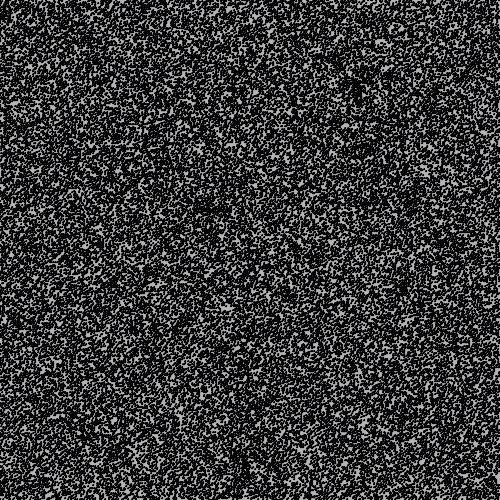

# Lab 5 — Comparators, lambdas, and streams 

This lab works through three topics:

- First, you will explore **Comparators** in Java, and explore different ways of creating comparators. One of those ways is using lambda expressions.
- In part 2, you will explore the mechanics of **lambda expressions** through a series of examples that you will complete. The examples might include unfamiliar *functional interfaces*—you can refer to the [Java documentation about functional interfaces](https://docs.oracle.com/en/java/javase/21/docs/api/java.base/java/util/function/package-summary.html) as you work through this lab.
- Following this, in part 3, you will use a closely related concept called **streams**, which allow you to "chain" multiple lambdas together to manipulate data and perform complex computations in combination.

The files for this lab are available on GitHub classroom: **LINK IN CANVAS**

## Part 1 — Comparators

This part uses the code in the `comparators` package. You'll notice that it contains the `Applicant` and `CourseGrade` classes from Lab 1, with some additions to the `Applicant` class.

For this part we will compare different implementations of the `java.util.Comparator` interface, including the use of lambda  expressions.
A `Comparator` allows, via the `compare` method, one to compare two objects to determine which "comes before" the other.
For example, one might define a `Comparator<Integer>` to determine which of  two `Integer` objects comes first by ascending order.

Various methods take `Comparator` objects to generalize algorithms (such as sorting).
The benefit is that passing different `Comparator`s allows for changing the order.
Use of the `Comparator` interface (especially as opposed to the `Comparable` interface) allows one to remove the "ordering" logic from the objects to be compared.
Instead, this logic is placed elsewhere to allow for multiple "orderings" of the same data.

The `Comparator` interface requires its implementing classes to implement a `compare` method that takes two arguments and returns an `int` value indicating the relative order of the arguments. A negative return value indicates that the first parameter object "comes before"  the second; a positive return value indicates that the second parameter object "comes before" the first; and zero indicates that the values are equivalent by the ordering.

### `NameComparator`

Define the `NameComparator` class (yes, for this part, as a class),  implementing `Comparator<Applicant>`, to compare two `Applicant` objects and order them by name (in ascending order). The `Applicant` class is in the provided  code.

*For example, when you compare the first and second songs in the song list, the result should be less than 0, because "Aakash" is lexically before "Sarah". Write another test case to test for alternative cases.*

Write a few tests of your `NameComparator` in the provided `TestCases.java` (in the `comparator` package) by comparing two `Applicant` objects (you may use elements of the `applicants` array).

### Average Comparator—As a Lambda Expression

Functional interfaces (those that declare only a single required method) can be "implemented" by lambda expressions.
A lambda expression is a stand-alone, anonymous function (in Java, they turn out to be shorthand for anonymous inner classes).

For this part you *will not* define a new class.
Instead, in `TestCases.java`, assign a lambda expression to a `Comparator<Applicant>` variable local to your testing method.
This lambda expression should act as a comparator on `Applicant` objects that orders them in ascending order of average grade.

_For example, when you compare the first and second applicants in the list ("Aakash" and "Sarah"), "Aakash" has a lower average than "Sarah". The comparator should return a number less than 0._

Write a few tests to verify that this comparator works. For the test cases you only need to compare two Applicants at a time (but consider writing more than one comparison to accurately test your implementation).

### Years Of Experience Comparator—Using a Key Extractor

If you examine the [Javadoc for `java.util.Comparator`](https://docs.oracle.com/javase/8/docs/api/java/util/Comparator.html) interface, you will notice that there are many more methods than `compare` that can be useful.
Of note are the many static methods that can be used to create `Comparator`s based on a "key extractor" function.

Write a few test cases test a `Comparator<Applicant>` ordering by `yearsOfExperience`, in *descending* order (in other words applicants with the _most_ experience would be listed first—getting this ordering properly may require a bit of research).
But for this part, you must use an appropriate `static` `comparing` method by providing a "key extractor" function.

*For example, when you compare the second and third applicants in the list, the result should now be greater than 0, because "Sarah" has 5 years of experience while "Moe" has 10, and we are comparing in descending  order.*

### Comparator Composition

The comparators defined thus far compare only a single field to determine an ordering, but it is often the case that when trying to order two objects one might want to order first by a primary key and then, if the primary key matches, by a secondary key.
For instance, one might wish to order applicants by years of experience and then by grade average for applicants with the same number of years of experience.

*For example, when you compare "Sarah" and "Aakash" in the list, they both have the same amount of experience, but different averages. When compared think about what the result would be based on their grade averages.*

Composition, or sequencing, as desrcibed above is a relatively common technique.
As such, the `Comparator` interface actually supports this via a (default) method named `thenComparing`.
On an existing comparator object, one can call `thenComparing` and pass to
it the next comparator to use in the sequence.

Declare a `Comparator<Applicant>` variable in a testing method and initialize it with a lambda expression (or using a key extractor) comparing Applicants by `yearsOfExperience`.
Then call `thenComparing` on this object, passing to this method _another_ comparator (or a key extractor) that will compare applicants by grade averages.
Write a test to verify that this comparator works as expected (i.e., orders by years of experience and by grade average when the years of experience match).

## Part 2 — Lambdas

At the surface level, a lambda expression can be seen as a syntactic simplification of a common use of anonymous inner classes (or even plain classes).
That is, when you only need to define a *single function* in a class (as is the case with interfaces that have only one abstract method), the lambda syntax lets you define *only* that function, instead of requiring you to write the entire class that surrounds it.

Though this syntactic reduction is of great value, lambda expressions, coupled with additional support throughout the Java libraries (in particular, the
`java.util.function` and `java.util.stream` packages), provide another means for designing programming solutions.

**Core task:** Examine the provided testing file in the `lambdas` directory.
Each test case includes some comments about the intended behaviour.
Edit the test cases so that they all pass.

**Note** that you should read the code to determine the correct expected value for each test case.
Running the tests and then just plugging the computed values back in will not improve your understanding of lambda
expressions.
You will want to solidify your understanding since we will continue to explore this feature for the remainder of the course and
because you will use lambda expressions in Java code beyond your academic career.

## Part 3 — Streams

This part explores *streams* through the implementation of a program to read in a set of numbers (representing *points* — specifically an image composed primarily of noise).
Through implementing various computational operations on these points they are transformed into a more coherent image (composed of points).

Streams are a useful tool to process collections.
In particular, with a collection of data with a sequence of commands/operations, streams allow for efficient processing (and can even leverage multicore parallelism, which is beyond the scope of this lab, but good to know about).
You can read more about them in the [Streams documentation](https://docs.oracle.com/en/java/javase/21/docs/api/java.base/java/util/stream/package-summary.html).

### Given files

There is no real "base code" for this part of the lab. You are given the `DrawPoints.java` file in the `streams` directory. 

**Do not modify this file.** You will use it at the end to run your code.

### Steps

**Task 1**

Start by creating a `Driver` class in the `streams` directory. That is, create a class called `Driver` that contains a `public static void main(String[] args)` method.

**Task 2 — Create a class to represent data.**

You'll need to read in data from a file. See the file `positions.txt` for the data.

This data represents a large number of points in space with an `x`, `y` and `z` value.
You’ll need to create a `Point` class to represent this data.
It may require adding more than just data members for `x`, `y`, and `z` (see tasks below).

**Task 3 — Read in the data**

In the `Driver` class, write code to read in the data from `positions.txt`.
The data is stored in the following format.

```
564.0, 414.0, 1
564.2765, 414.44946, 1
564.5011, 414.95673, 1
564.6649, 415.51572, 1
564.7596, 416.1191, 1
564.7776, 416.75833, 1
...
```

Your code should read in all the points and store them in a collection that can be processed as a stream.

You can read the contents of the text file using a `Scanner`, like we have seen in class. Refer to your `FileProcessor` from project 1 for help with this.

Below is a skeleton of what your code might look like.

```java
List<Point> points = new ArrayList<>();
Scanner scanner = new Scanner(new File("positions.txt"));
// Use the scanner to read the data from positions.txt, and populate the list of points

scanner.close(); // remember to close the scanner!
```

**Task 4 — Write the points to a new file**

To start with, just read in the points and write them back out to a different file named `drawMe.txt`.

The `FileWriter` is a good option for writing data to a file.
Explore the [FileWriter API](https://docs.oracle.com/en/java/javase/21/docs/api/java.base/java/io/FileWriter.html) to see how you can write data to a file.
I am deliberately giving you little information here—being able to read documentation is an important skill for a software engineer.

Don't forget to `close()` the file writer after you finish writing out the data!

After this process, `drawMe.txt` should be identical to `positions.txt`.
Use something like `diff` in the command line or just your eyes to visually confirm this.

**Task 5 — Streams**

The points represent dots that a helper program will draw on a blank canvas. The helper program is provided in `streams.DrawPoints.java` — it reads the points from the `drawMe.txt` file and draws them on a blank Canvas.

Once you run `DrawPoints.txt`, you should see the following figure appear:



After you have confirmed that you can read and write the points unchanged, work through the following operations ***using streams***.

* Remove all points that have a z value > 2.0
* Scale down the points by 0.5 
* Translate (move) all points by {-150, -37}

Be sure that you use stream operations like `filter` and `map` to complete these tasks.

Now run the `DrawPoints` program again to see the hidden figure!

## Submission

Demo your code to the instructor **and** push your code to GitHub by the due date.
