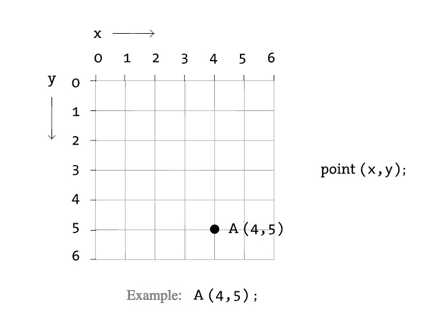
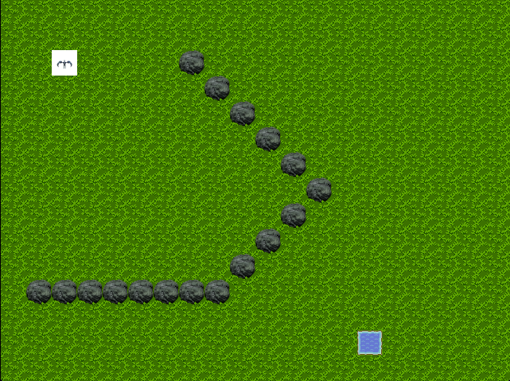
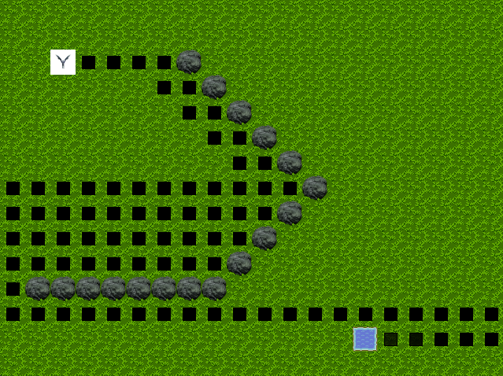
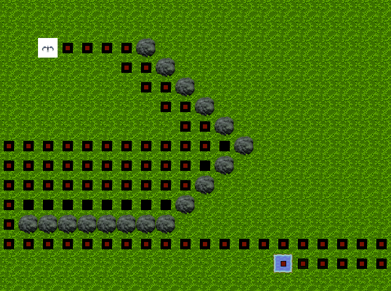

# CSC 203 - depth first search

This lab explores recursion through the implementation of a depth-first search on a two-dimensional grid (a simple graph).

## Objectives

- To implement depth first search
- Practice thinking about trajectory planning on a 2D grid structure

## Overview

Get the base code on GitHub: **LINK IN CANVAS**

Begin with the base code. Note that this code represents the world as a 2D occupancy grid. Note that Processing, the tool we will use for visual display of the 'world' and 'path', uses a 2D coordinate system (sometimes used to represent images), where {0, 0} is the upper left corner. This means that as the y value of a coordinate increases, the point is lower in the screen/world. This image shows the general structure. 



The project we have been working with this quarter is using a similar data structure.
This code is just a very simplified version of the virtual world.

Test to make sure the base code works for you. When your program starts it should look something like this.
Your goal is for the wyvern to find a valid path to the water, only traversing the grass and not the rock obstacles:



## Getting started - Background

Open the provided `PathingMain.java` file and read through the code.
This code is written in a very simple style to conform to the requirements of and to illustrate some features of the Processing library.
You will adapt this code to the project in an assignment.

Use of the Processing library begins with the definition of a class that extends `PApplet` and that includes a `main` method like the following:

```
public static void main(String[] args) {
   PApplet.main("PathingMain");
}
```

This class overrides two important methods: `setup` and `draw`.
The `setup` method is run once when, in Processing terminology, the "sketch" is created.
The `draw` method is called repeatedly (by Processing) and will contain the control logic of the "sketch".

You will also see that the code includes a two-dimensional array to represent the "world". This grid should be 20x15. For this lab, you will use this grid to store background tiles, obstacle tiles, and a goal tile. The code uses integer values to represent these different types of tiles, via an enum, specifically:

```
private static enum GridValues { BACKGROUND, OBSTACLE, GOAL, SEARCHED }
```

There is a `keyPressed()` method that can be used to activate your depth-first search. As it stands, in the base code, the pathing only traverses one neighbour, which you want to replace. The code is there to give you a good example of working with the grid data structure.

### Step 1

At this point you need to implement depth first search.
Note you can visit the neighbouring nodes in whichever order you prefer.

You should try visiting in various orders and ultimately make sure that you select an ordering that clearly illustrates the search runs into the obstacles at some point (i.e. don't pick directions that means you never visit a grid cell that is occupied by an obstacle).

**You are expected to implement your depth-first search recursively.** In fact _not_ doing it recursively will incur significantly more development effort, because you will need the recursion to help you construct the path that is chosen by your depth-first search.

Important: The only code you are expected to change is the `moveOnce()` method and the line of code that calls the method. Modify the `moveOnce()` functionality to become a depth first search method. Change its name as appropriate and make sure you change the code that calls `moveOnce()` to call your new method instead!



### Step 2

After the search completes, you will see the cells that were searched during depth-first search process.

Next, you'll want to make sure that your search comes up with a path from the wyvern to the water. Press `p` and you should see a path appear.

If this doesn't work, make sure you understand how cells are being added to path (and how the path is represented). In the below example image, all the cells with a black square have been visited, but the grid cells that make up the path is shown with red.



## Demonstration

Once you have completed the above steps, demonstrate completion of this lab to the course staff and push your code to GitHub.
